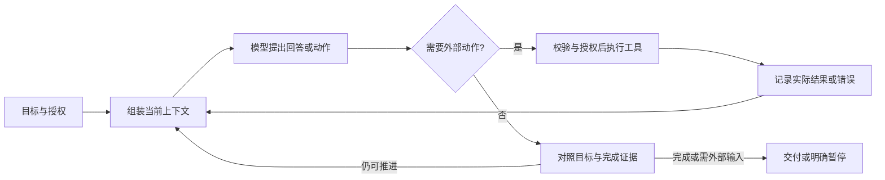

# Agent Harness Design：通用部件与模型定向适配调研

调研日期：2026-09-09。历史调研与已批准计划；用户随后授权全部实施及 commit、git push。
执行状态见同目录 THOUGHTS.md，最终验收见 [v0.5.0 评估报告](../../v0.5.0-evaluation.md)。

## 结论

建议保留一个独立 Skill，形成两个明确的知识入口：**通用 Harness 设计**和**模型定向适配**。前者从最小 Agent loop 展开到各部件的职责、接口、选择条件和验证；后者按目标模型版本、提供商接口和宿主条件，选择适用的协议要求与行为优化。

需要进一步区分：**通用不等于必须，模型专属也不等于可有可无。** 例如，持久化是通用设计议题，但短任务不一定需要；某个模型的推理状态回传则可能是调用成功的硬性条件。现有 Invariant / Default / Conditional pattern / Example 分级仍应保留，作为与“通用/模型”正交的维度。

另一个关键区分是**执行本 Skill 的模型**与**正在设计的系统所用模型**。用 GPT 审查一个 Qwen 系统时，应选择 Qwen 系统的适配资料，不能自动使用当前对话模型的规则。

本轮核对了源码和公开一手资料，未运行目标模型的对照实验；下文的优化建议均保留这一证据边界。

## 1. 当前 Skill 的基础与缺口

源码基线：`88aff97c0b33b9da0a39e9faf773a11eaf7739ae`，版本 `0.4.0`；开始调研时工作树干净。主 Skill 219 行，配有 8 篇 Markdown 参考资料。不是从零开始补一套理论，而是重组已有能力并补齐具体适配资料。

| 当前部分 | 已有能力 | 更新重点 |
|---|---|---|
| [SKILL.md](../../../plugins/agent-harness-design/skills/agent-harness-design/SKILL.md) | 激活范围、规则分级、能力保持、形态选择、评估 | 增加设计/审查入口与目标配置选择；按任务引导读取 |
| [design-decisions.md](../../../plugins/agent-harness-design/skills/agent-harness-design/references/design-decisions.md) | loop、工具粒度、资源治理、模型可移植性 | 把通用部件契约与模型迁移、行为补偿分开；增加从基本 loop 开始的连续说明 |
| [state-and-orchestration.md](../../../plugins/agent-harness-design/skills/agent-harness-design/references/state-and-orchestration.md) | 上下文、记忆、压缩、长任务、多 Agent | 区分上下文职责、宿主实现和模型依赖；把几种不同的恢复方式说清楚 |
| 信任、失败可见性两篇资料 | 权限、外部效果、错误、恢复与完成证据 | 保留这些基础；与正常执行路径衔接，避免只会审查控制措施 |
| [research-basis.md](../../../plugins/agent-harness-design/skills/agent-harness-design/references/research-basis.md) | 大量研究、实践与相反证据；注明访问日期 2026-09-04 | 从“来源支持某原则”进一步链接到具体部件、模型和历史案例；旧断言不能因已有引用就视为当前有效 |
| [evals.json](../../../plugins/agent-harness-design/skills/agent-harness-design/evals/evals.json) | 27 个设计判断场景，含原生适配、旧补偿退役等 | 补目标模型识别、协议与优化分类、错误套用规则、资料过期等场景 |

目前最欠缺的是两种使用体验：从基础开始设计一个 Harness，以及针对明确模型查到可以执行和验证的适配建议。现有资料更接近一套设计与审查原则。

### 拆分时还要重新校准现有断言

例如，`state-and-orchestration.md:57` 的“运行中不要增加或删除工具定义”，需要区分**修改已经生效的工具定义/历史前缀**和**通过原生机制逐步加载工具**。[Manus 的 2025 年经验](https://manus.im/blog/Context-Engineering-for-AI-Agents-Lessons-from-Building-Manus)强调缓存失效与历史引用不一致；[Claude 原生 tool search](https://platform.claude.com/docs/en/agents-and-tools/tool-use/tool-search-tool)则支持预注册、延迟加载和工具引用。这两个机制可以同时成立，不能合并成“所有动态工具发现都不应使用”。

`design-decisions.md:111` 建议遇到提前结束等症状先增加预算，也应改成诊断分支：先查真实耗尽、指令冲突、授权理解、协议错误和宿主终止事件。当前 [GPT-6 Astra 指南](https://developers.openai.com/api/docs/guides/latest-model#instruction-following)与 [Claude Fable 5.1 指南](https://platform.claude.com/docs/en/build-with-claude/prompt-engineering/prompting-claude-fable-5-1#finish-the-whole-task)都说明指令与协作习惯会影响持续执行；这些症状本身不足以定位预算原因。

这些是需要收窄适用条件的例子，不是建议把已有框架推倒重写。

## 2. 有代表性的前人资料及其用途

| 来源与时间 | 可以吸收的部分 | 不能直接推导的结论 |
|---|---|---|
| [ReAct 作者项目页](https://react-lm.github.io/)，2022 年工作 | 推理、行动、环境观察相互交织，是解释基本 loop 的经典起点 | 不能要求所有现代 reasoning API 输出显式思维链，也不是全部 Agent 架构的历史起点 |
| [SWE-agent / ACI](https://swe-agent.com/0.7/background/)，2024 年研究、旧版文档 | 命令、编辑和反馈格式本身影响 Agent 的可用性；工具接口应面向模型使用 | 不能把其旧版特定编辑器和上下文窗口策略推广到所有新模型 |
| [Anthropic：Building effective agents](https://www.anthropic.com/engineering/building-effective-agents)，原文 2024-12，当前页已提示生态变化 | 区分固定 workflow 与模型驱动 agent；给出 chaining、routing、parallelization、workers、evaluator 等模式 | 这些是可组合的选择，不是每个项目必须经历的升级阶段 |
| [Anthropic：Context engineering](https://www.anthropic.com/engineering/effective-context-engineering-for-ai-agents)，2025-09-29 | 指令、工具、检索、压缩与笔记共同组成上下文设计；按需读取 | “最小上下文”必须以任务所需证据仍完整为条件，不能机械删 token |
| [Anthropic：Long-running harnesses](https://www.anthropic.com/engineering/effective-harnesses-for-long-running-agents)，2025-11-26 | 初始化、功能清单、增量进展、交接与真实交互测试解决跨会话问题 | 不能据此要求所有任务都建立 initializer 和固定冲刺流程 |
| [LangChain：Anatomy of a harness](https://www.langchain.com/blog/the-anatomy-of-an-agent-harness)，2026-03-10 | 从目标行为倒推文件、执行环境、工具、记忆、上下文和编排等部件 | 作者以通用工作/编码 Agent 为主要视角；文件系统、Bash、Ralph loop 不是所有 Agent 的必装部件 |
| [Anthropic：Harness design for long-running apps](https://www.anthropic.com/engineering/harness-design-long-running-apps)，2026-03-24 | 同一任务族中，随着 Sonnet 4.5、Opus 4.5、4.6 变化重新检查上下文重置、冲刺和 evaluator 的作用 | 这是作者的实验与案例，不能宣称模型越新，所有编排和验证都应删除 |
| [OpenAI：Building agents](https://developers.openai.com/tracks/building-agents)，动态文档、本轮核对 | models、tools、state/memory、orchestration 等可组合原语；模型与提示要共同适配 | 具体 SDK/API 是实现选择，不能成为通用框架的强制依赖 |

建议在知识结构中保留这条历史线：**基本反馈 loop → 工具与环境接口 → 上下文与长期状态 → 按模型重新校准部件**。这些方向持续共存，不是后者淘汰前者。

## 3. 通用模块：从基本 loop 到部件设计

先讲一个任务、一个模型、一个工具的完整往返；把复杂度放在后续有条件的扩展中。下面是建议的概念图，不是已经实现的运行时。

一开始就说明：模型提出动作、运行时执行动作、环境给出结果，是三个不同角色；用户请求、模型回合结束、工具执行结束、任务完成，也不是同一个事件。无需把内部推理文本显式暴露出来才能构成这个 loop。

推荐逐部件回答四个问题：**负责什么、输入输出是什么、什么时候采用哪种方案、如何判断方案有效**。

| 部件 | 需要教会使用者的设计决定 | 典型失败与最小验证 |
|---|---|---|
| 目标与结果契约 | 输入如何成为可核实的目标；授权和后续修正如何生效；完成、暂停、失败如何区分 | 把“已经调用工具”当成完成；核对最终产物与要求 |
| Agent loop | 消息与事件如何进入下一轮；工具关联 ID；终止、重试、拒绝后的分支 | 丢失结果或重复执行；跟踪一次调用到实际结果 |
| 模型接口 | streaming、响应结构、工具协议、模型状态、错误码和能力协商 | HTTP 成功但丢了关键字段；验证请求/响应完整往返 |
| 工具 / ACI | 工具粒度、名称、schema、编辑格式、可发现性、错误与大结果反馈 | 参数合法但任务不可用；让模型完成一个真实工具任务 |
| 指令与 Skill 加载 | 优先级、激活范围、按需读取、模型/任务专属说明放在哪里 | 无关 Skill 接管任务或指导互相冲突；检查正例与邻近反例 |
| 上下文与检索 | 当前状态、长资料、检索、缓存前缀、多模态信息如何组织 | 必要证据遗漏、缓存策略破坏历史；检查同一目标在长短上下文下的完成情况 |
| 记忆与持久状态 | 工作状态、长期知识、事件证据、派生摘要的归属和更新规则 | 多份状态冲突、旧权限被重新激活；恢复后与真实环境核对 |
| 执行环境与权限 | 文件、进程、浏览器、网络、凭据、租户和资源隔离边界 | 动作越界或可用能力被过度限制；测试授权任务与应被拒绝的动作 |
| 规划与编排 | 何时留在单 loop；何时用固定流程、并行、子 Agent 或队列 | 重复工作、共享状态竞争、交接语义丢失；与简单方案比较 |
| 可靠性与恢复 | 超时、取消、断连、幂等、未知结果、checkpoint、恢复选择 | 把观测超时当失败而重试产生副作用；检查原调用实际状态 |
| 预算与交互 | token/耗时/费用/并发如何约束；进度、用户纠偏和暂停如何传入 | 过早停止、无期限循环、已授权动作重复问；检查资源轨迹和纠偏结果 |
| 评估与可观察性 | 环境结果、协议检查、设计评审、日志和线上反馈各证明什么 | 提高评分却未改善任务；检查结果、成本、误阻断与未验证范围 |

这是一张设计地图，不是每次都要执行的十二步检查表。短问答可能停在直接调用；长任务增加持久状态；需要外部效果时才展开相应执行边界；多 Agent 是一种选择。

同步 loop 应作为讲解入口，但不能成为通用的串行限制。例如 [OpenAI async tool calling](https://developers.openai.com/api/docs/guides/async-tool-calling)允许工具运行期间模型继续工作。应保持的通用性质是调用与结果正确关联、真实依赖被遵守、未完成工作可追踪；具体等待和调度方式属于接口与宿主适配。

## 4. 模型模块：分开协议契约、行为优化和训练解释

### 4.1 每份适配资料至少包含什么

| 信息 | 用途 |
|---|---|
| 目标配置 | 模型 ID/版本、reasoning 模式、API/端点、宿主及 SDK 版本；本地推理还需模板、parser、量化等关键条件 |
| 硬性接口契约 | 参数支持范围、消息角色、工具调用/结果结构、推理状态回传、签名、流式与停止事件 |
| 已观察行为 | 指令字面化、提前结束、检索触发、工具批处理、编辑方式、过度验证等具体表现 |
| 推荐适配 | 改哪一段提示、哪个工具、上下文策略或调度方式；何时不采用 |
| 证据与来源 | 文档契约、厂商建议、公开实验、本地复现或待验证假设；注明时间和任务分布 |
| 成本与风险 | 质量、延迟、token、缓存、误阻断、恢复成本、授权边界是否改变 |
| 复查与退役条件 | 模型/端点/宿主更新后查什么；何种反例或对照结果使规则停用 |

“官方文档要求”与“官方建议某种提示更有效”也要分开。前者通常需要兼容性检查，后者需要任务评估。没有完全匹配的档案时，给出通用设计和待核对项，不能把相近模型档案当作已经验证的替代品。

### 4.2 本轮查到的实际差异

以下是结构设计的代表性实例，不是所有当前模型的支持清单。动态文档均于 2026-09-09 读取；厂商描述的优化效果未在本机复现。

| 配置 | 文档明确的差异 | 应放在哪一类 |
|---|---|---|
| GPT-6 Astra | 工具调用要求 Responses API；不支持自定义 `temperature`/`top_p`。官方另建议检查 Skill 指令冲突、持续执行、子 Agent 使用和测试范围 | API 要求放契约；行为引导放模型建议，不把其子 Agent 提示推广为所有系统必须并行。[模型指南](https://developers.openai.com/api/docs/guides/latest-model)、[2026-09 更新记录](https://developers.openai.com/api/docs/changelog#september-2026) |
| Claude Fable 5.1 | 官方分别讨论编码 loop 中隐含独立工具调用的批处理、低 effort 检索触发和持续执行；其推理块还涉及精确对话前缀绑定，文档注明账户生效日期及 beta 条件 | 行为建议与带条件的历史/签名契约分开；不能简写成“Claude 必须总是这样”。[模型指南](https://platform.claude.com/docs/en/build-with-claude/prompt-engineering/prompting-claude-fable-5-1) |
| Gemini 3 系列 | 官方建议保留默认温度 `1.0`，较低值可能导致循环或性能下降；状态式 Interactions API 与手动历史管理的 thought signature 处理不同 | 温度是该系列建议；推理状态回传是接口契约。“低温更稳”不能写成通用默认。[开发指南](https://ai.google.dev/gemini-api/docs/gemini-3) |
| DeepSeek V4 Pro / Flash thinking | `medium`、`high`、`xhigh` 请求映射到实际 `high`；thinking 下某些采样参数被忽略。带 `tools` 与不带 `tools` 时，历史 `reasoning_content` 的回传和使用规则不同 | 参数接受不代表语义相同；应记录实际映射及消息协议，避免把 OpenAI-compatible 当作语义完全兼容。[Thinking Mode](https://api-docs.deepseek.com/guides/thinking_mode/) |
| Kimi K3 / K2.7 Code / K2.6 | 所读文档区分 thinking 是否常开、是否可关闭、是否支持 `reasoning_effort`、Preserved Thinking 是否默认启用 | 同厂商也必须按模型和模式区分，不能只有一张“Kimi 通用配置”。[Thinking models](https://platform.kimi.ai/docs/guide/use-thinking-models) |
| GLM-5.3、GLM-5.2 等 / 不同端点 | 文档区分强制 thinking 的型号；Preserved Thinking 在 Coding Plan 端点默认启用，在标准 API 默认关闭，启用后需完整回传推理内容 | 需要模型与端点两个维度；不能将某宿主测得的行为直接迁移到另一端点。[Thinking Mode](https://docs.z.ai/guides/capabilities/thinking-mode) |
| Qwen3-Coder（2025 历史样本） | 发布资料明确其 Agent RL 训练包含工具与环境反馈，并为 Qwen Code 定制提示与 function-calling 协议 | 是训练和接口适配的可核实案例，不能自动成为 Qwen3.8 的推荐配置；后者需单独资料和验证。[Qwen3-Coder](https://qwenlm.github.io/blog/qwen3-coder/)、[Qwen3.8 发布资料](https://qwen.ai/blog?id=qwen3.8) |

还有一个很直观的历史对照：[DeepSeek-R1 官方仓库](https://github.com/deepseek-ai/DeepSeek-R1#usage-recommendations)曾推荐特定温度区间与提示放置方式。它与现在 V4 thinking 的参数语义应保留为不同记录；不能拿旧 R1 经验覆盖整个 DeepSeek 家族。

### 4.3 如何处理预训练、SFT 和 RL

用户指出的训练差异值得作为适配的重要背景，但不宜直接建立“某种训练配方 → 必须使用某种 Harness”的规则。

- **预训练资料**帮助判断知识、语言、代码和上下文分布；这可以提出需要检索或特定任务检查的假设，不能单独证明某种工具接口更优。
- **SFT/指令训练资料**帮助理解任务示范、消息模板、输出风格和工具调用形式；推理服务实际使用的模板、parser 同样需要核对。
- **RL/偏好训练/Agent RL 资料**帮助理解奖励目标、环境反馈和长轨迹训练覆盖；是否需要额外规划、复核或停止提示仍须实测。
- **蒸馏、量化、推理模式、服务端实现**也会影响观察结果。一个 API 别名和模型家族名不足以确定其行为来源。

可核实的例子包括：[Qwen3](https://qwenlm.github.io/blog/qwen3/#post-training)公开了长 CoT 冷启动、reasoning RL、thinking mode fusion 与 general RL 的阶段；[DeepSeek-R1](https://github.com/deepseek-ai/DeepSeek-R1#2-model-summary)区分无前置 SFT 的 R1-Zero 路线与 R1 的 SFT/RL 组合。这些资料支持“训练路线不同”，没有自动证明特定提示或架构在用户任务上的因果收益。

对于未公开的训练细节，应明确未知。不要根据品牌或个别回答，把模型描述成固定的性格类型。

## 5. 历史架构应怎样保留

建议保存一个案例的完整因果问题链：**当时任务与模型 → 观察到的失败 → 加入的部件 → 验证结果与局限 → 新版本下重新测试 → 保留、调整或退役**。

[Anthropic 2026 年长任务案例](https://www.anthropic.com/engineering/harness-design-long-running-apps)正适合这样整理：作者解释了 Sonnet 4.5 阶段上下文重置的用途，Opus 4.5 阶段的调整，以及在 Opus 4.6 上去除冲刺结构、调整评估频率的过程；planner 与 evaluator 在部分条件下仍提供价值。应保留这些条件，而不是提炼成永久的“必须有三 Agent”或“新模型不需要 evaluator”。

历史放在可按需读取的案例资料中；当前推荐指向仍适用的条目。被替换的规则保留来源与替换原因，不继续混入当前默认提示。

## 6. 整个 Skill 的优化计划

以下是用户认可总体调研方向后提出、随后明确授权执行的实施计划。步骤是这次维护工作的安排，不会被写成每次使用 Skill 都要遵守的固定流程。

### 目标使用体验

优化后的 Skill 应能处理四类请求：从零设计 Agent、审查现有 Harness、定位一条运行失败、评估模型迁移及其适配。按请求交付架构建议、具体问题与依据、诊断分支或迁移差异；共同说明相关部件、适用配置、证据和验证方式。

支持编码、研究和业务服务等 Agent。文件系统、Bash、规划器、向量库与多 Agent 都按任务选用，不能因案例偏编码而成为所有系统的必备项。普通软件开发、一般任务记录和单纯派发继续保持原有激活边界。

### 七个步骤及其完成条件

| 步骤 | 具体工作与交付 | 依赖 | 完成条件 |
|---|---|---|---|
| 1. 校准现有内容 | 检查当前入口与 8 篇参考资料，将重要指导归为通用职责、条件方案、接口契约、模型建议或历史案例；删重复、收窄绝对化表述 | 本报告与当前源码 | 核心约束仍在；重要规则能说明范围与依据；没有把旧实例直接推广成通则 |
| 2. 建立通用设计路径 | 新增简短架构导读，串联基本 loop 与本报告的部件地图；补齐职责、输入输出、选择条件、失败及验证示例，复用现有参考文件 | 1 | 能从一个模型和一个工具讲清完整往返，也能解释长任务为何增加状态、恢复或编排；各部件能单独查询 |
| 3. 建立模型适配模块 | 定义目标配置选择方式，建立有材料支撑的厂商/型号档案，分开接口契约、行为优化、训练背景与未知项 | 1；与 2 共用部件术语 | 能对两个模型的同一设计问题给出有依据的不同建议；不会误用当前咨询模型或相近型号的配置 |
| 4. 改造 Skill 使用入口 | 主入口说明何时进入通用设计、何时读模型资料，覆盖新建、审查、诊断和迁移；按任务深度给结果 | 2、3 | 新会话能找到相关材料并完成请求；不需要先读全部文献或全部厂商资料；短问题不会被强制展开为完整架构审查 |
| 5. 整理历史和更新方式 | 复用 research-basis，加入少量能改变设计判断的演进案例；规定新证据如何更新当前建议、历史记录和相关场景 | 2、3 | 当前建议与旧方案可以区分；每条重要变化能追溯来源、时间、适用条件与修订原因 |
| 6. 做行为验收并修正 | 复用现有 runner 和案例；比较当前版本与候选版本，检查实际设计结果、读取路径和模型规则选择；对声称有效的行为优化做目标系统对照 | 4、5；相关场景可在前面试用 | 具体用例成功；协议正确性与行为收益分开报告；失败修正后只重跑相关检查，未验证的配置保持明确标识 |
| 7. 发布与分发验证 | 更新实际变化需要的版本和说明，完成上游提交/发布后刷新该插件的 Marketplace pins 和生成包；验证打包后的新会话 | 6；发布时使用适用的用户授权 | 源码、版本、pin、包与分发证据对应；独立安装可用；安装状态与源码发布状态分别报告 |

### 内容如何落到现有目录

- `SKILL.md`：共同目的、必要约束、目标配置识别、按需读取与结果要求。
- `references/architecture-guide.md`（拟新增）：从最小 loop 到部件地图，链接现有 design、state、trust、failure、evaluation 等资料。
- `references/model-adaptation.md`（拟新增）：适配选择方法、记录结构、未知配置处理和验证标准。
- `references/models/`（拟新增）：先按厂商组织有内容的档案，在文档内区分具体型号、模式和端点；规模影响查找时再细分文件。
- 现有 `research-basis.md`：来源和案例入口，必要时链接有实际内容的案例参考页。原始运行材料继续留在仓库的 reports / eval-results。
- 现有 `evals/`、`tests/` 和 runner：补必要场景，保留可用的执行与评分能力；仅在具体缺口阻碍验证时修改运行器。

本次先把上述结构写清楚并用普通 Markdown 连接。无需为资料维护新增数据库、注册中心或模型路由程序。模型档案中的优化建议是给设计者选择的材料，不是安装 Skill 后自动修改某个运行时的配置。

### 首批覆盖与中间样例

通用部件覆盖本报告第 3 节的整张地图。模型资料建议覆盖上轮已有实质材料的七个方向：OpenAI、Anthropic、Google、DeepSeek、Moonshot、Z.ai 和 Qwen。每家只记录已核实的具体配置；历史 Qwen3-Coder、DeepSeek-R1 与当前型号分开，不把收录某家误报为支持该家全部模型。写入时重新核对容易变化的参数和协议。

在全量内容整理中，先贯通一个中间样例：**工具调用 loop + 推理状态 + 长任务恢复**。用它检查通用章节、模型档案与入口是否相互衔接，再继续覆盖其余部件。这是验证组织方式的中间检查点，不替代整个优化范围。

首批真实模型试跑采用执行时实际可用的目标模型/宿主，并明确记录配置。文档有依据的条目可以作为文档支持的建议收录；只有真实对照支持时，才能标记为已验证有效。没有模型访问条件时交付具体未验证项，不伪造结果或把文字评分当运行证据。

### 验收用例

| ID | 请求或场景 | 应观察到的结果 |
|---|---|---|
| A1 | 从零设计一个只需查询资料的简单 Agent | 解释完整 loop 与必要部件；不强制添加规划器、多 Agent 或持久存储 |
| A2 | 设计跨上下文、可恢复的长期 Agent | 说明状态归属、恢复入口、真实环境核对、待处理调用和完成证据 |
| A3 | 同一工具调用问题分别指定两个有不同契约的模型 | 通用任务语义保持一致，接口和状态处理建议按目标配置变化，来源可核对 |
| A4 | 执行 Skill 的模型与被设计系统的模型不同 | 按被设计系统选择资料，不把当前对话模型的限制套给目标 |
| A5 | 提供旧版本经验、缺少确切型号或引用厂商别名 | 明确适用边界、未知和需要补查的信息，不声称未经验证的兼容 |
| A6 | Agent 提前结束，但没有预算耗尽证据 | 区分指令、协议、宿主和预算等诊断分支，不直接要求加预算或添加控制器 |
| A7 | 查询一个具体部件，以及普通软件开发的邻近请求 | 部件问题按需读取；无关任务保持原有激活范围 |
| A8 | 模型升级后评估一个旧补偿措施 | 保留有依据的当前规则，提出相关对照；不会按“新模型”直接删除全部补偿 |
| A9 | 新安装的分发包进入新会话 | 模型档案和引用资料实际可达；入口可指导任务；报告真实宿主边界 |

这是已批准的验收范围，执行结果单独记录。复用现有案例中相同的行为，避免新增只是换了措辞的测试。

### 两种验证不能混在一起

**Skill 行为验证**检查建议是否正确、是否尊重目标、是否选择了正确资料。现有 [v0.4.0 评估报告](../../../reports/v0.4.0-evaluation.md)和 runner 可以继续用于比较，但原报告记录的是 ZCode / GLM-5.2 下的回答与激活；不能当成所有目标 Harness 已被验证。

**目标系统验证**检查模型专属优化的实际效果。在相同目标模型、任务、环境及可比较资源条件下，对比合法可运行的基线与候选，观察任务结果、错误、成本、延迟和恢复。基线也必须满足提供商硬性契约；不能故意丢签名或传不支持的参数，再把修好协议称为智能优化。

不设一个脱离用途的综合分数来判定所有设计。按具体用例报告通过、失败和未验证；保留原始产物与必要证据。对随机性有影响的性能主张使用重复对照，对确定性协议要求做针对性检查。

### 后续怎样持续更新

更新由模型/宿主发布、API 变更、真实失败或新的可信研究触发：定位受影响的部件与档案，核对证据，更新建议和旧条件，重跑受影响的场景，再按正常链路发布。接口要求在实际采用前实时核对；长期原理在出现新证据时修订。

维护规则先与现有资料放在一起。是否建立定时监测属于单独的后续选择；资料维护本身不需要先完成自动化系统。

## 7. 调研阶段的范围记录

在实施授权之前，调研阶段仅新增这份报告与同目录 `THOUGHTS.md`。未修改可分发 Skill、版本、Marketplace pins，未安装、commit、push，也未运行付费模型评估。

调研阶段交付了第 6 节的具体优化计划；其后用户要求全部落地并提交推送。以下未验证范围描述的是调研阶段，最终执行证据以发布评估报告为准。

公开来源已实际读取；动态文档记录的是本次查询到的状态。旧版文档、厂商自述和未经本机复现的优化，已分别说明其限制。本轮没有逐一审计旧 `research-basis.md` 的全部文献，也没有证明所有新模型在所有宿主上的运行行为。
